# Homework 1

Michele Avella

**mat**: 2024548

**mail**: michele.avella@studenti.unipd.it

## Regressions

### Problem 1

The goal of this project is to develop a dense neural network able to approximate a scalar function: 

$$
f:\mathbb{R}  \rightarrow \mathbb{R}, \quad x \rightarrow f(x); \quad \text{network}(x) = g(x) \simeq f(x).
$$

The train dataset is $100$ points and the test dataset is $100$ points. In both of them a noise is added on the $y$ axis in the following way $y = f(x) + noise$. In the figure below they are both visualized in a two dimensional plane.

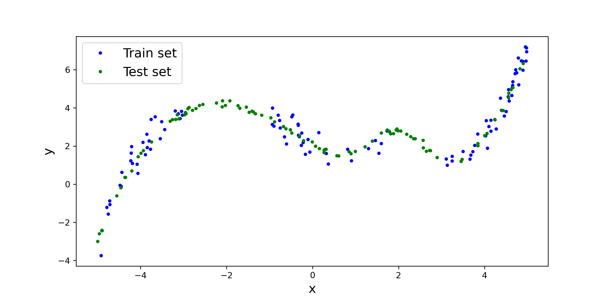

### Methods 1

To approximate the target function $f(x)$ we use a dense neural network (DNN) with three hidden layers. The structure of the DNN is quite simple since the train dataset is small and the problem is not too complex. 

| Layer  | Dim | Act fun |
| - | - | - |
| Input | 1 |sigmoid |
|Hidden 1| $N_{H_1}$ |sigmoid |
|Hidden 2| $N_{H_2}$ |sigmoid |
|Hidden 3| $N_{H_3}$ |sigmoid |
| Output | 1 |

The loss is a Mean Square Error loss (MSE): $$loss = \sum_i (y_i - g(x_i) )^2$$ where $g(x)$ is the approximate function.
We use a L2 regularization to avoid overfitting. Since the training set is small we use a K-fold method (with $k = 3$) to choose the best model. 
We use $pytorch$ to implement the neural network and $optuna$ to do the hyperparameter tuning. With $optuna$ we perform a random search with $25$ trials. Batch size is $20$ and the number of epochs is $1000$. The hyperparameters are the parameters of the DNN, the learning rate, the optimization algorithm and the regularization.

### Results 1

After the $25$ trials the best model is :

| Hyperparameter  | Range | Best value |
| - | - | - |
|Hidden 1| 10 - 50 | 45 |
|Hidden 2| 10 - 50 | 21 |
|Hidden 3| 3 - 30 | 23 |
|learning rate  | $10^{-3} - 10^{-1} $| 0.016 |
|L2 regularization|$10^{-4} - 10^{-1} $ | 0.0003 | 
| Optimizer | Adam, SGD, RMS |Adam |

The test loss is:
$$test loss \simeq 0.27$$

Below the learning profile (left) and the best model approximation (right)

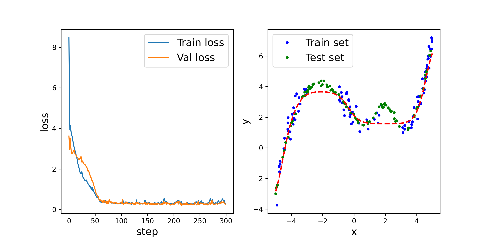

___

We visualize the weight distribution of each layer and the activation profile of each layer given different inputs. All this information can be found in the appendix. 

### Comments and possible improvements 1

As we can see in the figure above the predicted function it is not perfect and fails to approximate the test set in particular around $-2$ and $2$. This problem can be partially solved by increasing the number of nodes of each layer and increasing the number of trials of the hyperparameter tuning.

## Classification

### Problem 2

The goal of this project is to classify images of clothes. For this task we use a DNN and a CNN.

The dataset we use is the fashionMNIST that is a collection of 28 x 28 images of clothes divided in 10 classes:

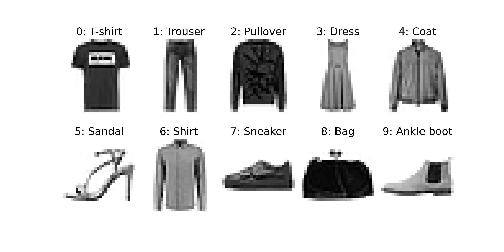

The train dataset has $60000$ images and the test dataset $10000$ images.
### Methods 2

To classify the images we use two different networks, the first one is a DNN and the second is a CNN. 
The structure of the DNN is the same as the regression except for the output dimension that is 10. The structure of the CNN is the following:

| Layer  | Dim | Info | Act fun|
| - | - | - | - |
| Input | 1 x 28 x 28 || ReLU |
|Conv 1| $N_{C_1}$ |  kernel = 4, padding = 1 |ReLU |
|Conv 2| $N_{C_2}$ |  kernel = 5, padding = 1 |ReLU |
|Hidden 1| $N_{H_1}$ | |Sigmoid |
|Hidden 2| $N_{H_2}$ | |Sigmoid |
| Output | 10 | | |

The loss is the Cross Entropy : $$loss = -\sum_{i = 1} ^{10} y_i \log p_i $$ 
where $y_i$ is $1$ if the prediction is correct otherwise is 0; $p_i$ is the predicted probability.

We use a L2 regularization to avoid overfitting. Even in this case we use a K-fold method (with $k = 3$) to choose the best model. 
We use $pytorch$ to implement the neural network and $optuna$ to do the hyperparameter tuning. With $optuna$ we perform a random search with $10$ trials. Batch size is $200$ and the number of epochs is $20$. The hyperparameters are the parameters of the CNN, the learning rate, the optimization algorithm and the regularization.

## Results 2

After the $10$ trials the best DNN model is :

| Hyperparameter  | Range | Best value |
| - | - | - |
|Hidden 1| 10 - 50 | 49 |
|Hidden 2| 10 - 50 | 26 |
|Hidden 3| 3 - 30 | 24 |
|learning rate  | $10^{-3} - 10^{-1} $| 0.002 |
|L2 regularization|$10^{-4} - 10^{-1} $ | 0.0001 | 
| Optimizer | Adam, SGD, RMS |Adam |

The test loss is:
$$test loss \simeq 0.35$$
Accuracy: $$\frac{ \text{right pred} }{ \text{test set}} = 87 \%$$

___

After the $10$ trials the best CNN model is :

| Hyperparameter  | Range | Best value |
| - | - | - |
|$N_{C_1}$| 4 - 10 | 4 |
|$N_{C_1}$| 10 - 15 | 12 |
|Hidden 1| 20 - 50 | 38 |
|Hidden 2| 20 - 50 | 28 |
|learning rate  | $10^{-3} - 10^{-1} $| 0.008 |
|L2 regularization|$10^{-4} - 10^{-1} $ | 0.0001 | 
| Optimizer | Adam, SGD, RMS |Adam |

The test loss is:
$$test loss \simeq 0.30$$

Accuracy: $$\frac{ \text{right pred} }{ \text{test set}} = 89 \%$$

Confusion matrix:

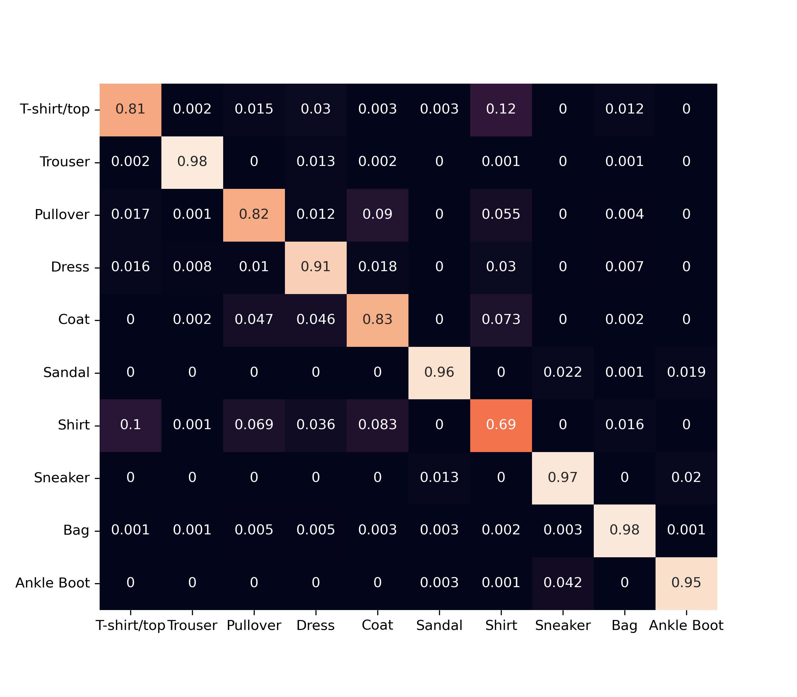

___
For the CNN we do further analysis: we visualize the weight distribution of each dense layer (appendix), the receptive fields of the convolutional layers (appendix) and the activation profiles of the convolutional layers. 

Activation profile:
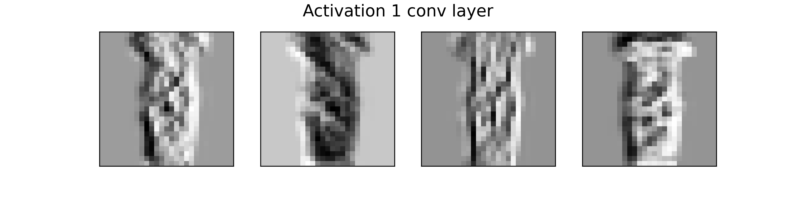
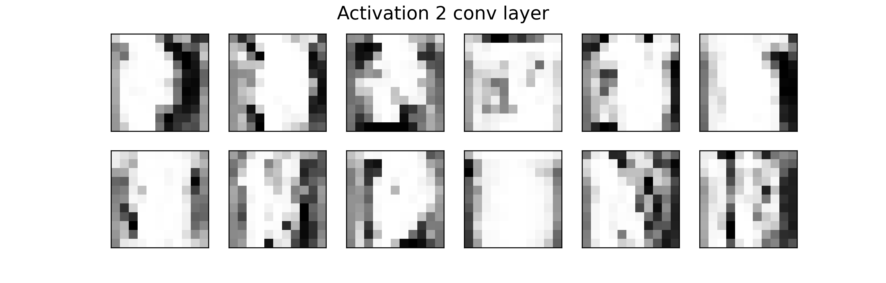
If we look at the activation profiles we can see that the first convolutional layer captures the overall features of the image; in fact we can still distinguish the shapes of the original image. 
Whereas the second layer captures the more abstract features of the image and it is difficult to interpret.

### Comments and possible improvements 2

With both the CNN and DNN we are able to predict the right class $\simeq 87 \%$ of the times. This dataset is quite simple and so both models work very good. If we work with larger images with colors (3 channels) it is not possible to use a DNN and achieve good performances.

If we look at the confusion matrix (CNN) it is evident that the three problematic classes are: T-shirt, Pullover and Shirt. In particular the last one is often confused with one of the other two which make sense since they are hardly distinguishable.

Even in this case performances can be improved by adding more convolutional layers and/or performing more trials during hyperparameters tuning. In this homework I was limited by the computational power of my laptop.

## Appendix

### Regression

Distribution of weights:
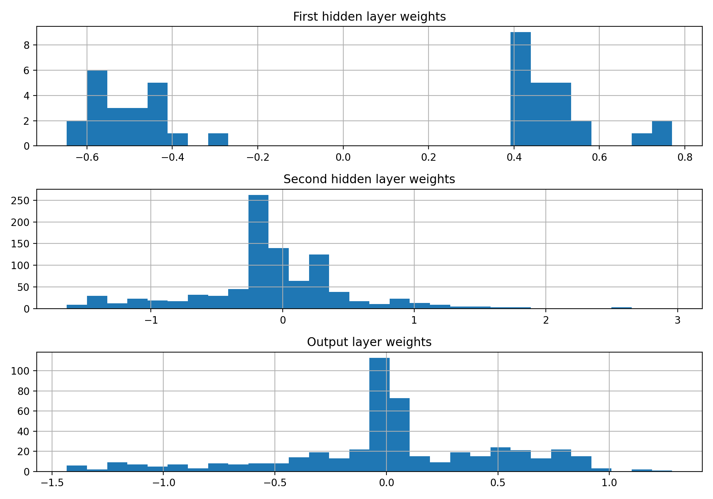

___

Activation profiles:
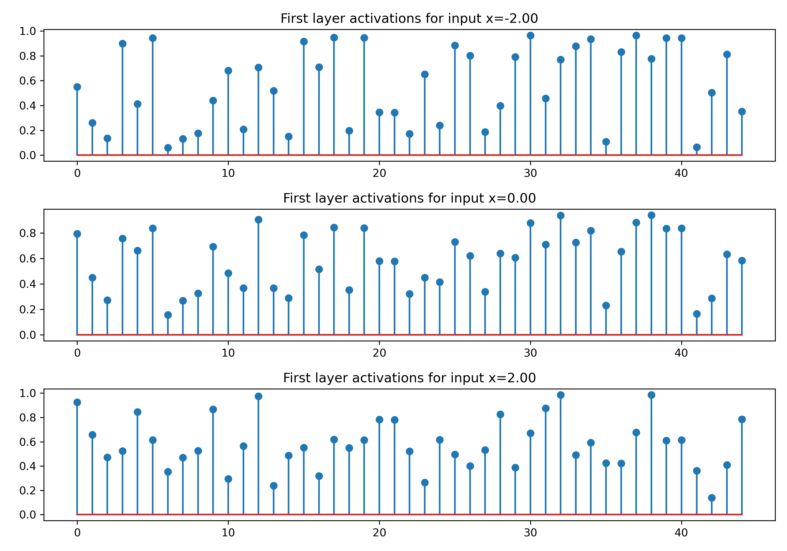
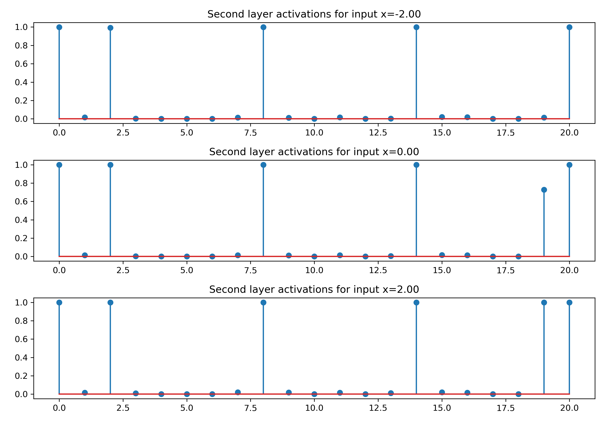
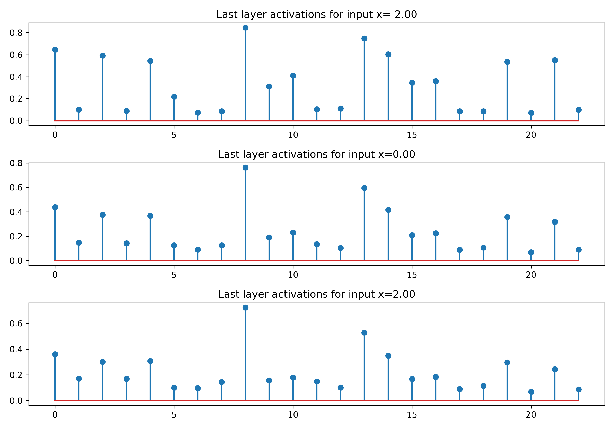

### Classification (CNN)

Distribution of weights:
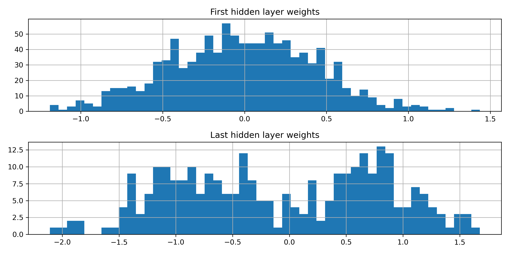

Receptive fields:
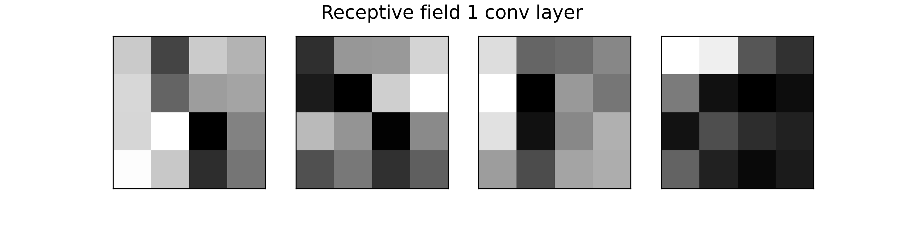
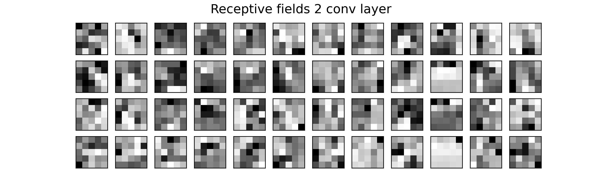

