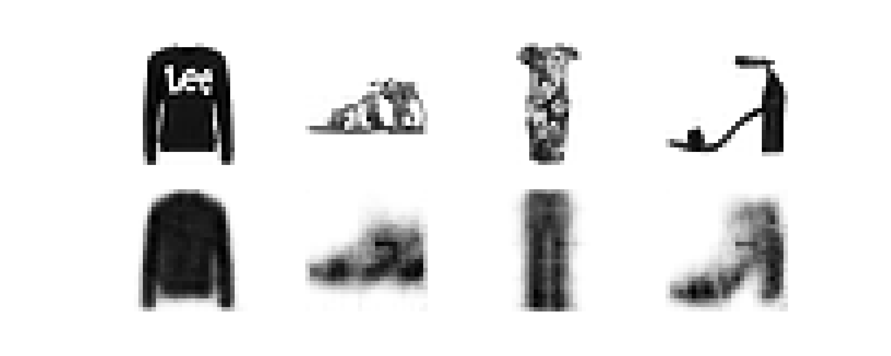

# Homework 1

Michele Avella

**mat**: 2024548

**mail**: michele.avella@studenti.unipd.it

## Autoencoder

### Problem

**1) Autoencoder**

The goal of this project is to develop a convolutional autoencoder for clothes images. 

An autoencoder is composed by two part: the encoder and the decoder:

- The encoder is a neural network that that takes high dimensional data as input and returns low dimensional data as output. In our case it takes as input a 28 X 28 image and returns a $L$ dimensional vector with $L \in \{2,4,6\}$. The output space of the encoder is called **latent space**. 

- The decoder does the opposite. It takes as input a vector from the latent space and returns an vector of the original high dimensional space. In our case the output is a 28x28 image.

In our case we use a CNN as encoder and as decoder and we design the two component to be symmetric.

The autoencoder can be summarized in the following way:

$$
\vec{V} \in \mathbb R ^N\rightarrow \text{encoder} \rightarrow \vec v \in \mathbb R ^L\rightarrow \text{decoder}\rightarrow \vec V '\in \mathbb R ^N
$$

where $N$ is the dimension of the original space.

The aim of the autoencoder is to reduce the input vector $\vec V$ to 
$\vec v$ and then reconstruct the latent 
vector $\vec V '$ as similar as possible to 
$\vec V$ . This is a unsupervised problem since we do not use labels but we compare the output 
$\vec V '$ with the 
input 
$\vec V$ trying to minimize their difference. 

___

**2) Exploration latent space**

Once we have the trained autoencoder, we can explore and visualize the latent space. To do so we first use the encoder to map all the training samples to the latent space and then we use PCA or TSNE to reduce more the dimension down to $2$ dimensional vectors. We can then visualize those vectors (points) in a simple $2$ dimensional scatter plot. 

Another feature of the autoencoders is the possibility of generating new samples, in our case new images. To do so, we take a random vector from the latent space and we use the decoder to generate a new image.
___

**3) Fine tuning**

We can take advantage of the autoencoder (in particular the encoder part) to develop a multiclassifier. To do so we use a trained encoder and we stick a dense neural network to it. In this way the input space of the neural network is the latent space and the output dimension is the number of classes, in our case 10. In this way we can take advantage of the encoding part of the autoencoder to use only the relevant features of the input images. This is of course a supervised learning problem and we train only the DNN.
Below a scheme of it:

$$
\vec V \rightarrow \text{encoder} \rightarrow \vec v \rightarrow \text{DNN} \rightarrow \text{class}
$$
___

**4) Variational autoencoder**

In traditional autoencoders, inputs are mapped deterministically to a reduced vector $\vec V \rightarrow \vec v$. In variational autoencoders, inputs are mapped to a probability distribution over latent vectors, and a latent vector is then sampled from that distribution:

$$
\vec V \rightarrow \vec \theta \rightarrow  \vec v \sim \vec \rho (\vec \theta)
$$

The decoder becomes more robust at reconstructing reduced vectors as a result.

**Dataset**

The dataset is the same of the Homework 1, the fashionMNIST.

### Methods

**1) Autoencoder**

The encoder and the decoder are symmetric. The encoder is a convolutional neural network (CNN) with the following structure:

| Layer  | Dim | Info | Act fun|
| - | - | - | - |
| Input | 1 x 28 x 28 ||  |
|Conv 1| $N_{C_1}$ |  kernel_size=3, stride=2, padding=1 |ReLU |
|Conv 2| $N_{C_2}$ |  kernel_size=3, stride=2, padding=1 |ReLU |
|Conv 3| $N_{C_3}$ |  kernel_size=3, stride=2, padding01 |ReLU |
|Hidden 1| $N_{H_1}$ | |ReLU |
| Latent space | $L$ | | |

the decoder is the same but in the opposite direction.

We use a mean square error loss (MSE): $$loss = \sum_i (V_i' - V_i)^2.$$ We use a L2 regularization to avoid overfitting. We use a K-fold method (with $k = 3$) to choose the best model. 
We use $pytorch$ to implement the neural network and $optuna$ to do the hyperparameter tuning. With $optuna$ we perform a random search with $10$ trials. Batch size is $250$ and the number of epochs is $5$. The hyperparameters are the parameters of the encoder and decoder, the learning rate, the optimization algorithm and the regularization.

___

**2) Exploration latent space**

To visualize the latent space we have to reduce its dimension to $2$. To do so we use two different algorithms:

**PCA**: principal component analysis is a linear transformation that projects the original variables into new variables ranked by the variance. In this way we can use the first two new variables to represent our data.

**TSNE**: T-Distributed stochastic Neighbor Embedding is a non-linear transformation that reduces the data dimensionality by keeping points close in the original space, close in the reduced space.

___

**3) Fine tuning**

The DNN that we use in the fine tuning is the following:

| Layer  | Dim | Act fun|
| - | - | - |
| Input | $L$ ||
|Hidden 1| $30$ |ReLU |
|Hidden 1| $60$ |ReLU |
| output | $10$ | |

We use a L2 regularization. We use Cross Entropy loss. The optimizer is Adam with learning rate $10^{-3}$. Batch size is $250$ and the number of epochs is $20$. 

___

**4) Variational autoencoder**

In our case we use a normal distribution to sample reduced vectors $\vec v$. In the encoding part instead of having a linear layer connected to the latent space we have to parallel linear layers, 
one for the mean $\mu$ and 
one for the standard deviation $\sigma$. 

From this two layers we can then sample the latent vector in the following way:

$$\vec v = \{v_1, v_2, ... v_L\} \; : \; v_i = \mu_i + \sigma_i \epsilon_i \quad \text{with} \quad \epsilon_i \sim N(0,1)$$

Regarding the loss, we have to add another regularization term that is the KL divergence between $N(\mu,\sigma)$ and 
$N(0,1)$ to 
avoid $\mu$ 
and $\sigma$ to explode and overfit the training set.
The final loss will be:

$$
 loss = \text{MSE}(\vec V, \vec V') + \lambda \cdot \text{L2} + \text{KL}(N(\mu,\sigma),N(0,1))
$$

We use optimizer Adam with learning rate $10^{-3}$. Batch size is $2000$ and the number of epochs is $20$. The variational autoencoder structure (convolutional layers, nodes ..,) is the same as the autoencoder.

## Results

**1) Autoencoder**

After the $10$ trials the best autoencoder model is :

| Hyperparameter  | Range | Best value |
| - | - | - |
|$N_{C_1}$| 8 - 10 | 8 |
|$N_{C_2}$| 15 - 20 | 17 |
|$N_{C_3}$| 25 - 35 | 32 |
|Hidden 1| 60 - 80 | 69 |
|$L$| 2 - 4 | 4 |
|learning rate  | $10^{-3} - 10^{-1} $| 0.003 |
|L2 regularization|$10^{-4} - 10^{-1} $ | 0.0001 | 
| Optimizer | Adam, SGD, RMS |Adam |

The test loss is:
$$test loss \simeq 0.02$$

In the next figure three images $\vec V$ (top) and 
the reconstruction $\vec V'$ (bottom). 
As we can see the autoencoder is able to shrink the images down to $4$ dimension and then reconstruct the images keeping the relevant informations like the shape but ignoring details like the write on the first shirt.

___

**2) Exploration latent space**

The PCA is not enough to separate the clusters in $2$ dimensions. We can see that different clothes are divided in different clusters but they overlap.

TSNE works better. We can clearly distinguish separate clusters. The only problem is with the $shirt$ class that is spread out and overlaps with other similar classes. This is reasonable since the shape of the shirt is similar to $tshirt$ and $pullove$.

The last features of the latent space is the possibility to generate new images. As said before the decoder captures the general features of the clothes and not the details. In this case if we draw a point in the latent space that is inside a cluster the image will be clear. If we draw a point inside a overlap region between different clusters the image will be a mixture (bottom left image is a mixture of $dress$ and $trouser$).

___

**3) Fine tuning**

After $20$ epochs this is the result.

Below the convergence profile. We can see that there is a bit of overfitting. We tried to get rid of the overfitting by changing the layers size and the regularization but without success; the problem should be in the encoder, probably a latent space of $4$ dimensions is too small and does not store all the relevant information.

Accuracy: $$\frac{ \text{right pred} }{ \text{test set}} = 75 \%$$

The accuracy is smaller than what obtained with the CNN but if we consider that the latent space is $4$ the result is impressive. If we look at the confusion matrix we can see that the main problem is the $shirt$ class. This was predictable already from the visualization part because the $shirt$ cluster overlaps with other clusters. To improve the performances, we should improve the autoencoder and/or the dimension of the latent space.

___

**4) Variational autoencoder**

Below reconstructed images obtained using the trained variational autoencoder:

The test loss of variational autoencoder and autoencoder are both around $0.02$.

