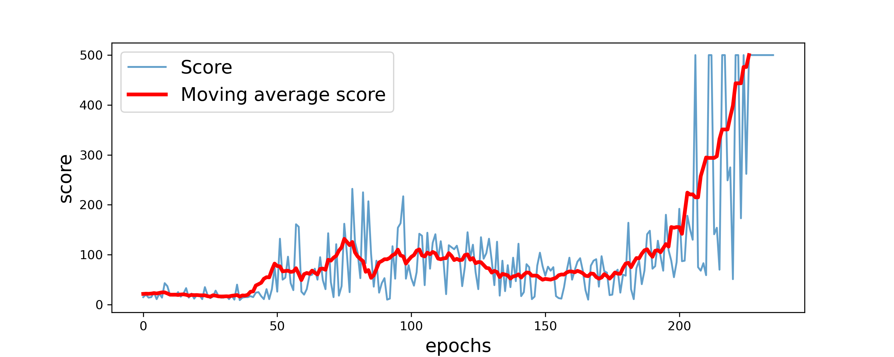
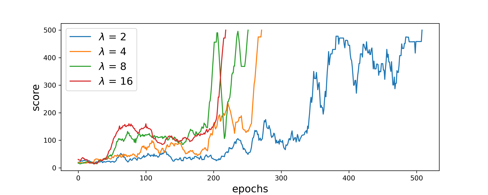
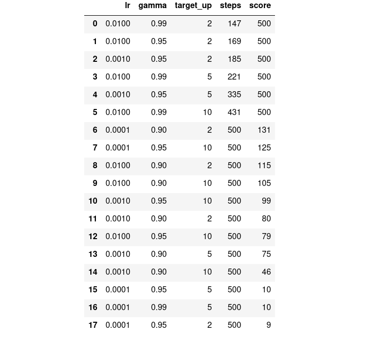
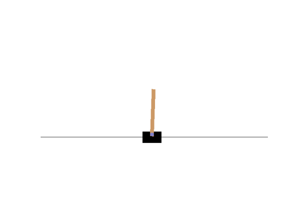
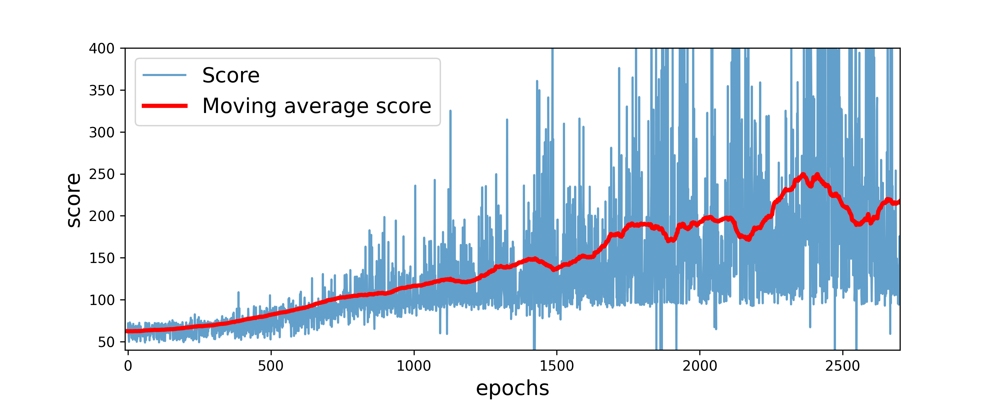

# Homework 3

Michele Avella

**mat**: 2024548

**mail**: michele.avella@studenti.unipd.it

## Reinforcement learning

### Problem 

The goal of this project is to develop a deep learning network able to "play" two different games. These are **reinforcement learning** problems.

The two games are:

1) **Cart pole**: there is a cart with a pole on top of it. The agent has to maintain the pole vertical as long as possible by moving itself to the left or to the right. 

    The action space dimension is $2$ : 

    - push to the right;
    - push to the left. 
    
    The state space dimension is $4$: 
    
    - position of the cart;
    - position of the pole;
    - speed of the cart;
    - angular speed of the pole.

    The game ends after $500$ time steps or when the poles angle with the cart is greater then $13$ degree. The score is the number of time steps until the end of the game.

2) **Flappy bird**: a bird has to go as far as possible without hitting obstacles (pipes). On the bird acts the force of gravity that pulls it downward but the bird can flap its wings and move upward.

    The action space dimension is $2$:
    
    - do nothing;
    - flap the wings.

    The state space dimension is $2$:

    - horizontal distance to the next pipe;
    - vertical distance to the next pipe.

    The game ends when the bird hits a pipe or the ground. The score is the number of time steps until the end of the game.

Both games belong the the GYM library.

### Methods 

The reinforcement learning procedure can be summarized in the following way:

1) An agent interacts with the environment and gets the current state,

2) According to current state, the Agent takes an action with strategy/policy in the environment.

3) The Agent gets the reward from the environment and update its strategy/policy.

4) After taking the action, the environment updates and reaches to next-state.

5) Repete 1–4.

The algorithm to train the model is called **Deep Q learning**.  The policy in Q-learning is modeled as an action-value function $Q(s, a)$, which represents the expected long term reward from state $s$ and action $a$:

$$
Q(s,a) = \mathbb E [r_t + \gamma r_{t+1} + \gamma^2r_{t+1} + ... | s,a]
$$

where $\gamma$ is the discount factor and $r_t$ is the reward at time t.

In deep Q-learning, we use a neural network to approximate the Q-value function. In our case we use the following:

| Layer  | Dim | Act fun|
| - | - | - |
| Input | $S_D$ ||
|Hidden 1| $30$ |ReLU |
|Hidden 1| $60$ |ReLU |
| output | $A_D$ |Sigmoid |

where $S_D$ is the space dimension and $A_D$ is the action dimension. 

We train our model by minimizing the loss:

$$
L = \mathbb E_{s,a,r,s'}[(r_t + \gamma \max _{a'} Q^T(s',a'))- Q(s,a)^2]
$$

where $Q^T(s,a)$ is the Q value computed with a target network. $Q^T(s,a)$ is cloned from $Q(s,a)$ every $\tau$ steps, this increase the stability of the training.

In addition, in order to make the convergence occurring faster we use an **experience replay**. It acts as a buffer,
and allows the learning from past experience once
the network has gained “enough experience”. Practically, this has been implemented using deque objects from $python$.

The action performed by the agent is chosen according to the **epsilon greedy policy**.
With an epsilon-greedy policy it chooses a random action with probability $\epsilon$, otherwise chooses the best action (the one corresponding to the highest Q-value). The $\epsilon$ is usually called temperature.
The $\epsilon$ is not constant but decreases during the learning.
Epsilon greedy temperature:

$$
\epsilon_i = e^{-\lambda \cdot i / N_{epochs}}.
$$

This term is tuned by $\lambda$ that determines how fast the agents goes from the explorative phase to the exploitive phase.

- In the explorative phase the agent sometimes acts randomly to explore new states and improve itself. 
- In the exploitative phase the agent acts always according to the best Q value.

In the cart pole game we study how the convergence of the algorithm changes with $\lambda$

**Cart pole**

We tune hyperparameters $\gamma$, $\tau$, $lr$ :

|Par|Val|
|-|-|
|$\gamma$|$0.9, 0.95, 0.99$|
|$\tau$|$2,5,10$|
|$lr$|$1^{-2},1^{-3},1^{-4}$|
|$\lambda$|5|

We use Adam as optimizer. We add a term $ -|x_c| $ to the reward to keep the cart at the center of the screen.
We run the training for $500$ epochs. If the last $10$ epochs all reached the best score ($500$) we stop the training. 

**Flappy bird**

In this case we use this set of hyperparameters:

|Par|Val|
|-|-|
|$\gamma$|0.97|
|$\tau$|10|
|$lr$|5e-3|
|$\lambda$|5|

We use Adam as optimizer. We add a term $ -|\Delta y| $ to the reward to set the bird in the optimal vertical position before passing a pipe.

### Results

**Cart pole**

Convergence profile for a given set of hyperparameters:

as we can see the profile (blu) is very noisy because of the random initial conditions of the environment and because of the temperature. If we look at the moving average it is almost monotonic meaning that the training works good.

___

This is the result for the tuning of $\lambda$; we plot the convergence profiles:

In this case the the number of steps needed to reach the best model decreases with increasing of $\lambda$. 

___

For the hyperparameter tuning: *score* is the score at the end of the training and *steps* is the number of epochs of the training. The results (target_up is $\tau$):

We can see that:

- $\gamma = 0.9$ the agent never reaches the maximum score.

- $lr = 10^{-4}$ the agent hardly never the maximum score.

- Small $lr \;\text{and}\; \tau$ increase the speed of convergence.

___

Gif of the game:

___

**Flappy bird**

Convergence profile:

For this game the convergence profile is even noisier than the cart pole. This is because the randomness of the game is not only in the initial conditions by during all the game (height of the pipes). 

To improve the performance of the agent we should have the position of the next two pipes instead of only the next one.
___

Gif of the game:

